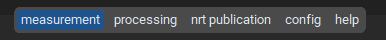
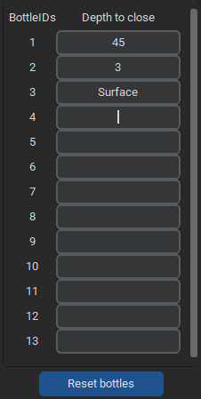
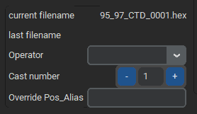
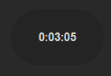
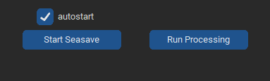
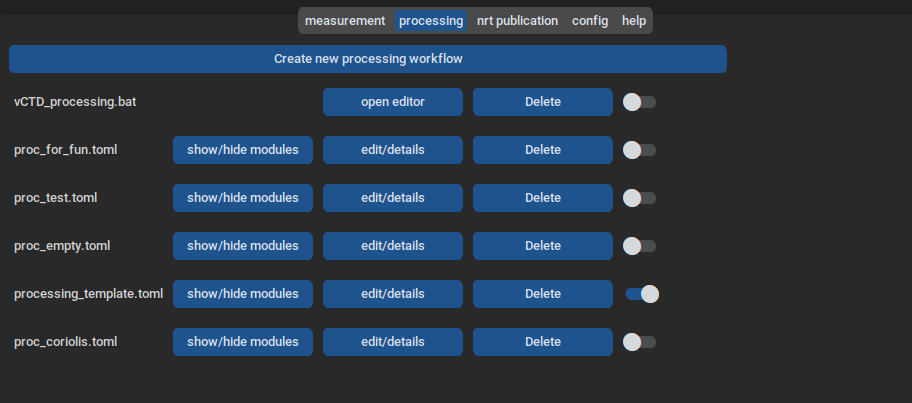
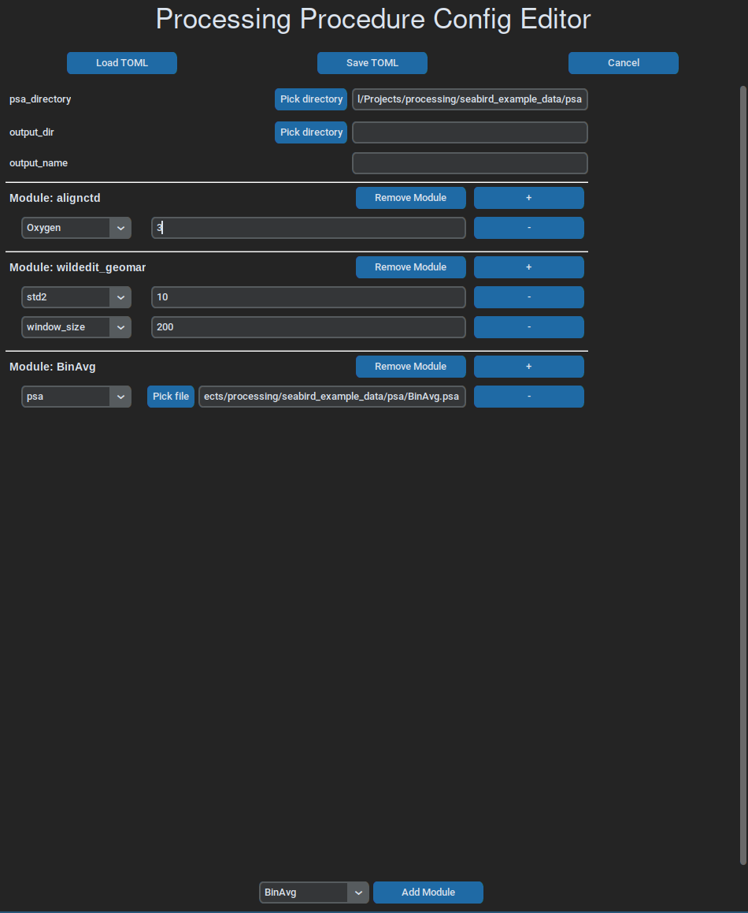
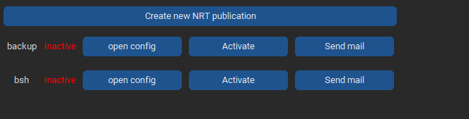
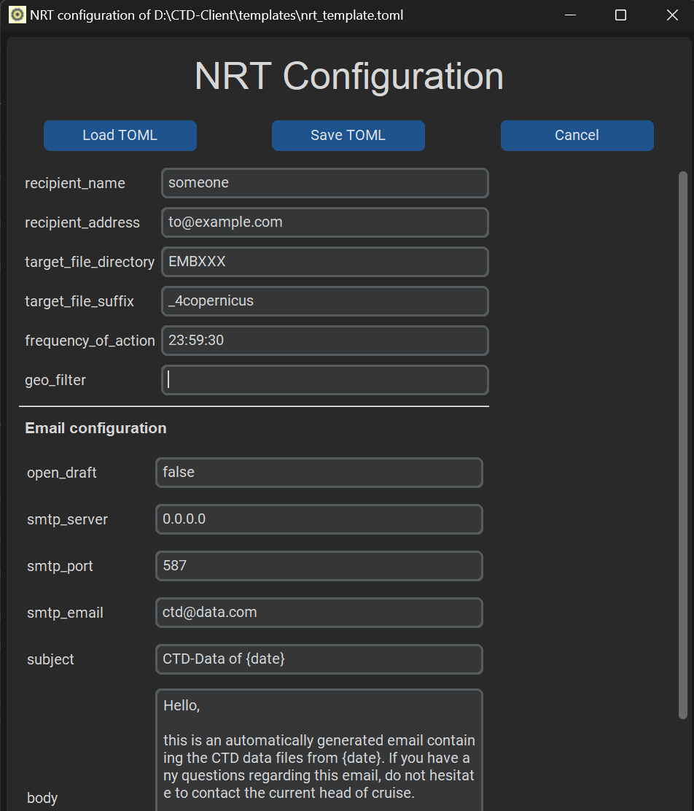

# CTD-Client

## Intro

The CTD-Client is a program that supports the measurement of CTD-data
with Sea-Bird CTDs. Calls Sea-Birds measuring software, Seasave, with
certain parameters and alters its configuration file prior to
measurements. This way, a variety of functions can be achieved:

- primarily tags data files with metadata from the ship information
  system available on german research vessels (DSHIP)
- allows for programmed bottle closing time configuration
- can run processing scripts using Sea-Bird processing modules and
  custom ones, via [the ctdam python
  package](https://github.com/DAM-CTD-Software/ctdam).
- supports Near-Real-Time distribution of CTD data via email
- saves relevant usage data for continuous operation

## Basic feature description

### Metadata injection

Using DSHIP, or a comparable ship information system whose data can be
retrieved via simple TCP/IP-calls, all kinds of ship metadata can be
saved to the Sea-Bird custom header. This way, all data files, from raw
.hex data, to .btl or .cnv data files will feature the metadata
information. Additionally, other metadata, like a continuous bottle
number for a whole cruise, can be put into the metadata header. The file
name of the data file will also be build from different pieces of
metadata.

### Programmable bottle closing

If the automatic firing of water bottles is wanted, for example when
using free-flow bottles, those can be programmed inside the CTD-Client.
The software can also adjust for hardware-specific time delays between
firing individual bottles.

### Processing

Processing raw data after measurements is also supported. The different
processing steps to run can be configured in a separate tab, while the
execution will be a single bottom press on the main page. That way, the
data can be easily processed in seconds after a successful measurement.
The configuration window does also feature a very intuitive alteration
of processing workflows, allowing for quick and constant playing around
with the data.

### Near-Real-Time data distribution

All acquired data can automatically send to different stakeholders or
other interested parties. The distribution protocol is email and can be
set to sending daily to a specific time or after each processing
workflow.

## Usage

<!-- start usage -->

CTD-Client uses tabs to display different pieces of information to the
user. Simply clicking on one entry will let you switch to that tab.

### How to measure

> [!IMPORTANT]
> The CTD-Client comes with sensible defaults, but some things need to be
> configured before using it first time. So have a look at [the configuration info](https://dam-ctd-software.github.io/CTD-Client/installing.html#configuration)
> to set up for measurement.

For measurements you can safely stay inside of the tab of the same name.
Here, you can see different areas to interact with:

#### DSHIP information

This panel displays selected DSHIP parameters that can be chosen inside
of the configuration tabs. You cannot interact with these values in any
way, they are solely meant for information. Internally, these values are
used for the metadata header and the file name.

#### Water bottles

Here, you can see the number of water bottles that are set up and can
assign depth values to them. After starting a measurement, these values
are used for automatic bottle firing. You can insert any value you want,
but only positive numbers will be used as bottle closing depths. All
other values will be an internal signal to Seasave, that the CTD
Operator plans on closing this bottle. This information will result in
Seasave offering this bottle as next to fire, if it is the lowest one,
seen in cronological order, after all automatic bottles have been fired.
Setting a non numerical value to a bottle can therefore be used as a
reminder for the operator to close this bottle manually under a certain
condition. When arranging the Seasave window(s) and the CTD-Client, one
can also keep an eye on any pieces of information that has been entered
here previous to measurement.

#### Data file and metadata information

Shows the currently generated file name, the last file name written and
allows selection of operator, which will be used as metadata point
inside the .hex header. Additionally allows to manipulate the 'Cast'
number, a basic counter of all the individual CTD casts conducted during
a cruise. The Pos_Alias can also be overwritten, if the value
retrieved from DSHIP or another ship data provider does not work for
this cast or is not wanted.

#### Stopwatch

Basic stopwatch that can only be set back to zero upon clicking on the
watch widget. Will count up until infinity. Can be used to track all
kinds of CTD cast specific waiting times. We use it mostly to ensure a
constant soaking time before each cast.

#### Measurement and Processing start/stop bottoms

Allows to start a measurement (calling Seasave) or a processing (see
below). After starting either one of these, the respective button
changes to a \'cancel\' button. When clicking this, the corresponding
process will be killed immediately.

### How to process

Processing a .hex or .cnv file can be done by clicking 'Run
Processing' on the measurement tab. This opens a file selector where
the target file to process can be selected. The selected file will be
used as input for all scripts and/or processing workflows selected in
the processing tab. These workflows basically allow the user to easily
build a series of processing steps that are meant to be run on the
target data file. In-depth description of processing workflows can be
found in [the documentation of the ctdam python
package](https://dam-ctd-software.github.io/ctdam).

Available processing modules are the standard Sea-Bird ones (which need
to be installed on your machine), custom ones from the growing
collection inside ctdam and all TEOS-10
functions, through the [gsw python
package](https://teos-10.github.io/GSW-Python).

> [!IMPORTANT]
> Orchestrating all these modules with their diverse background is quite
> complex, if one aims for a drag-and-drop behavior. So be forgiving if
> some combinations need some more tinkering. You can also file a [bug](https://dam-ctd-software.github.io/CTD-Client/bugs.html),
> if things go really wrong.

You can customize workflows in the \'Processing\' Tab. Here, a list of
the available workflow files and other scripts can be seen.

> [!NOTE]
> For other custom processing scripts to appear here, they need to be put
> into the [configuration directory](https://dam-ctd-software.github.io/CTD-Client/installing.html#configuration)

They can be turned on and off by a switch, which means that they are
going to run upon clicking \'Run Processing\'. Note that all activated
workflows will run sequentially, sorted by alphabet, as in the
\'processing\' tab. To edit the individual files, click
\'edit/details\'. That will open a new window with the respective files
configuration:

### How to use Near-Real-Time Publications

A Near-Real-Time Publication (NRT), in the context of this software, is
any kind of distribution of data. There are to ways of distribution
available: simple copying to a target location and the sending of
emails, with the data files attached. The other important distinguishing
factor for a NRT is the trigger, when to distribute the data files. At
the moment, there are two kinds of triggers: one that waits for a
processing routine to finish, and one that runs daily at a certain time.
The first variant sends only the just processed file, while the other
one filters a target data file directory for files that are from the
same day. Both variants additionally allow a geographical filter, that
checks the candidate files coordinates against a polygon of coordinates,
that must be given in any form that geopandas can handle. All the
configuration options for a single NRT are saved in a .toml file. A
template can be obtained from inside the software. A configuration file
needs to be prefixed with \"nrt\_\" and have the .toml extension. More
details concerning configuration can be found
[here](https://dam-ctd-software.github.io/CTD-Client/installing.html#configuration).

#### Usage

To configure and use NRTs you need to open the \'nrt publication\' tab.
Here, all the necessary information is displayed for each individual
nrt. For each entry, three buttons are provided, that allow the
configuration, activation/deactivation and the direct publication of new
data, according to the settings that have been configured.

To create a new NRT, click on the \'create new NRT publication\' button.
This opens a new window that allows to enter the necessary information.
It will be pre-filled with template information.

#### NRT Configurator

Short description of the individual field values and their uses:

**recipient_name**: plain desriptor for the overview table

**recipient_address**: either a target path for copying or a list of
email addresses, comma-separated

**target_file_directory**: the directory to scan for new files to
publish

**target_file_suffix**: a file descriptor that can occur anywhere in the
files that are meant to be published

**frequency_of_action**: either \"each_processing\" for
NRT publications after each successful processing, or a time point in
\"HH:MM:SS\" format

**geo_filter**: a path to a file that contains polygon coordinates in a
geopandas-compatible format, eg. .shp

**open_draft**: whether to open the email message as a draft inside an
email client instead of directly sending the email blindly

**smtp_server**: the email server to use for sending

**smtp_port**: the port to use for sending

**smtp_email**: the email address to send from

**subject**: the email messages subject

**body**: the text of the email message. Does take a placeholder {date}
that will be substituted by a timestamp

> [!IMPORTANT]
> When creating a new NRT that is going to send emails, make sure to test
> the email settings by setting the \'open_draft\' option to true. That way,
> instead of sending the emails directly, the draft will be opened in the
> system email program, to allow reviewing its contents prior to sending.

<!-- end usage -->

## Context

This software is developed at the [Leibniz-Institute for Baltic Sea
Research, Germany (IOW)](https://io-warnemuende.de/en_index.html) for
the [German Marine Research Alliance
(DAM)](https://www.allianz-meeresforschung.de/en) in the context of the
Underway Research Data Project. It is therefore primarily targeted for
use on German research vessels, which are all using the
DHSIP-information managing system. Feel free to reach out, if you think
we should generalize to other forms of ship information systems.
