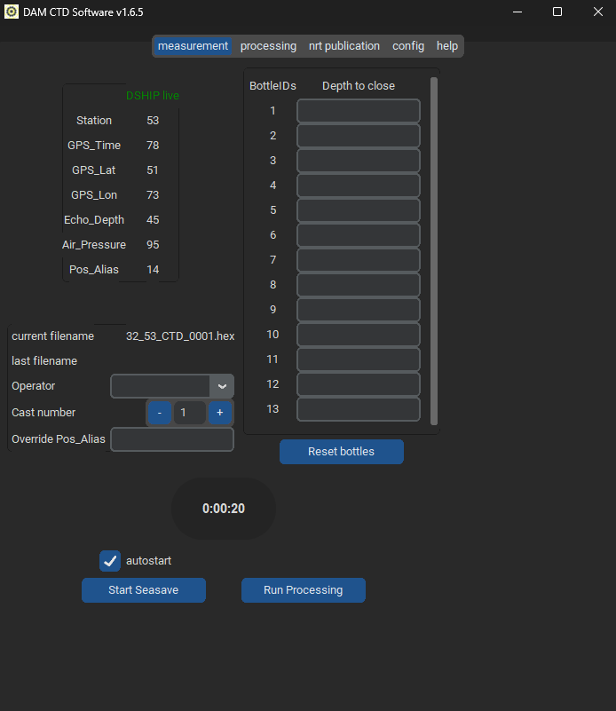

Welcome to the CTD-Client!
==========================

This is the documentation for the CTD-Client developed at the
`Leibniz-Institute for Baltic Sea Research, Germany (IOW)
<https://io-warnemuende.de/en_index.html>`_ in the context
of the 
`Underway Project of the German Alliance for Marine Research (DAM)
<https://www.allianz-meeresforschung.de/kernbereiche/datenmanagement-und-digitalisierung#unterwegs>`_.

.. include:: ../../README.md
   :parser: myst_parser.sphinx_

.. toctree::
   :maxdepth: 1
   :caption: Contents:

   installing
   usage
   bugs
   API <modules>

.. toctree::
   :maxdepth: 1
   :caption: Links

    Code <https://git.io-warnemuende.de/CTD-Software/CTD-Client>
    DAM Underway Project <https://www.allianz-meeresforschung.de/kernbereiche/datenmanagement-und-digitalisierung#unterwegs>
    IOW <https://io-warnemuende.de/en_index.html>
